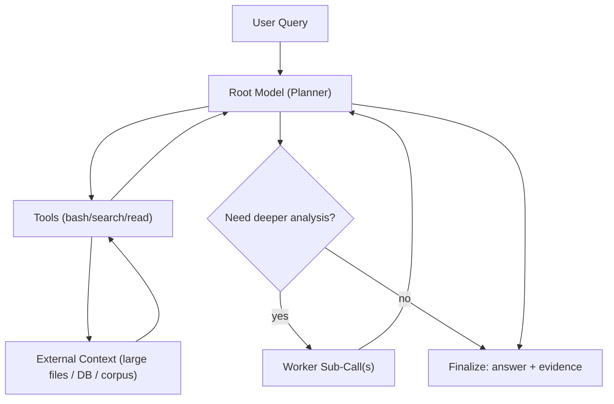

# Recursive Language Model Prototype (Bun + TypeScript + AI SDK + just-bash + OpenRouter)

This project implements a lightweight but strict Recursive Language Model runtime:

- Root session queries large external context with a `bash` tool
- Bash command output is externalized into handles (not injected as raw transcript text)
- The model reads bounded slices via `readHandle(handleId, start, length)`
- Recursive `llmQuery` sub-sessions run with depth and budget limits
- Finalization requires machine-verified evidence quotes against source files
- JSONL run tracing captures commands, handles, reads, recursion, and finalization

## Research Credit

This prototype is inspired by the paper:

- Zhang et al., **Recursive Language Models** ([arXiv:2512.24601](https://arxiv.org/abs/2512.24601))

## What Is an RLM?

A Recursive Language Model (RLM) treats large context as an **external environment** instead of stuffing everything into one prompt.

At a high level:

1. A root model plans what to inspect.
2. It retrieves handle metadata from a large context store.
3. It reads only small bounded slices from those handles as needed.
4. It can delegate focused synthesis to recursive child model calls.
5. It aggregates verified evidence and returns a grounded final answer.



## What Problems RLM Solves

- **Context window pressure:** avoids sending huge corpora in a single prompt.
- **Cost and latency blowups:** only retrieves and reasons over small relevant slices.
- **Weak traceability:** requires evidence-backed outputs from concrete retrieved snippets.
- **Single-pass brittleness:** uses iterative search and optional subcalls when the first pass is insufficient.

## 1) Install

```bash
bun install
```

## 2) Configure

Create `.env` and set:

```bash
OPENROUTER_API_KEY=...
```

Optional:

```bash
RLM_ROOT_MODEL=openai/gpt-4o-mini
RLM_WORKER_MODEL=openai/gpt-4o-mini
RLM_MAX_STEPS=12
RLM_MAX_SUBCALLS=4
RLM_MAX_RECURSION_DEPTH=3
RLM_HANDLE_READ_CHARS=2000
RLM_HANDLE_PREVIEW_CHARS=160
RLM_MAX_CONTEXT_FILES=10000
```

## 3) Seed synthetic large context

```bash
bun run seed --docs 2000 --secret PURPLE-GRAPE --secret-doc 842
```

## 4) Run agent

Recursive mode (default):

```bash
bun run ask --query "Search the context and find the secret code."
```

Tool-only mode (no worker recursion):

```bash
bun run ask --mode tool-only --query "Search the context and find the secret code."
```

Direct mode (no tools):

```bash
bun run ask --mode direct --query "Search the context and find the secret code."
```

`direct` now loads the full context directory into one prompt as a single-call baseline. On very large corpora this can be expensive and may exceed the model context window.

## 5) Compare modes

```bash
bun run bench --query "Search the context and find the secret code."
```

This runs `direct`, `tool-only`, and `recursive` modes and prints quick success/latency results.

### Benchmark Snapshot (February 9, 2026)

Command:

```bash
bun run src/cli.ts bench --query "Search the context and find the secret code." --context ./context-bench
```

Observed output:

- `direct`: `ok=true`, `durationMs=6328`, `steps=1`, `tokens=122116`
- `tool-only`: `ok=true`, `durationMs=3928`, `steps=5`, `tokens=1815`
- `recursive`: `ok=true`, `durationMs=5000`, `steps=5`, `tokens=1827`

## Guardrails

- Read-only bash allowlist (`pwd`, `ls`, `find`, `grep`, `sed`, `awk`, etc.)
- Blocked dangerous shell patterns (`rm`, `mv`, redirects, command substitution, `find -exec`, `xargs`, etc.)
- Step budget, sub-call budget, and recursion depth budget
- Constant-size tool-return invariant: bash output is stored in handles + metadata only
- Bounded `readHandle` slices to inspect output incrementally
- Structured `finalize` tool requiring evidence paths + exact quotes with verification

## Run Metrics

Each `ask` and `bench` run reports:

- `durationMs`
- `steps` (root/worker/total)
- `tokens` (`input`, `output`, `total`)

These metrics are also stored in each JSONL run log under the `run.finish` event.
